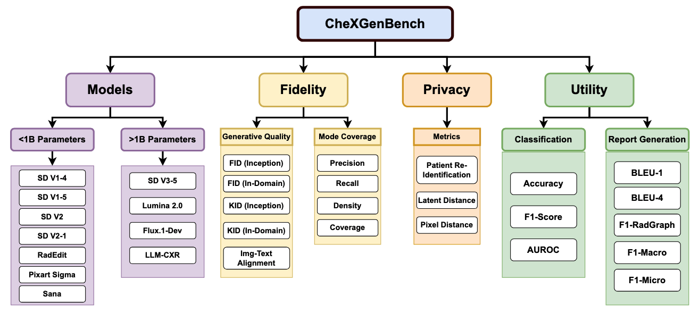
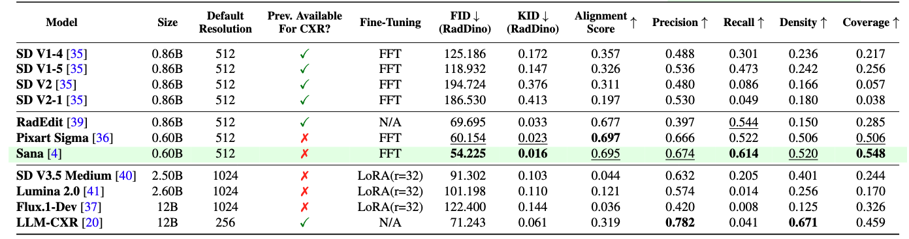

# CheXGenBench: A Unified Benchmark For Fidelity, Privacy and Utility of Synthetic Chest Radiographs

## Contents

- [Overview](#overview)
    - [Quantitative Analysis](#quantitative-analysis)
        - [Generative Quality Metrics](#generative-quality-metrics)
        - [Diversity and Mode Coverage Metrics](#diversity-and-mode-coverage-metrics)
    - [Qualitative Analysis](#qualitative-analysis)
- [Usage](#usage)
    - [Generating Synthetic Data](#generating-synthetic-data)
    - [Calculating Global Metrics](#calculating-global-metrics)
    - [Calculating Conditional Metrics](#calculating-conditional-metrics)
    - [Calculating Privacy Metrics](#privacy-metrics)

# Overview



**Abstract:** We introduce CheXGenBench, a rigorous and multifaceted evaluation framework for synthetic chest radiograph generation that simultaneously assesses fidelity, privacy risks, and clinical utility across state-of-the-art text-to-image generative models. Despite rapid advancements in generative AI for real-world imagery, medical domain evaluations have been hindered by methodological inconsistencies, outdated architectural comparisons, and disconnected assessment criteria that rarely address the practical clinical value of synthetic samples. CheXGenBench overcomes these limitations through standardised data partitioning and a unified evaluation protocol comprising over 20 quantitative metrics that systematically analyse generation quality, potential privacy vulnerabilities, and downstream clinical applicability across 11 leading text-to-image architectures. Our results reveal critical inefficiencies in the existing evaluation protocols, particularly in assessing generative fidelity, leading to inconsistent and uninformative comparisons. Our framework establishes a standardised benchmark for the medical AI community, enabling objective and reproducible comparisons while facilitating seamless integration of both existing and future generative models. Additionally, we release a high-quality, synthetic dataset, SynthCheX-75K, comprising 75K radiographs generated by the top-performing model (Sana 0.6B) in our benchmark to support further research in this critical domain. We open-source our comprehensive evaluation pipeline, benchmark along with our fine-tuned models, which establish new state-of-the-art performance in synthetic radiograph generation.

## Quantitative Analysis



The quantitative analysis assesses the synthetic data at two distinct levels to provide a granular understanding of its quality:

- **Overall Analysis:** This level calculates metrics across the entire dataset, encompassing all pathologies present in the MIMIC dataset. It provides a general indication of the synthetic data's overall quality.
- **Conditional Analysis:** This level calculates each metric separately for each individual pathology present in the dataset. This allows for a detailed assessment of how well the T2I model generates synthetic data for specific medical conditions.

### Metrics

The benchmark employs a range of established metrics to evaluate different aspects of the synthetic data.

#### Generative Quality Metrics

These metrics evaluate how well the synthetic images resemble real medical images in terms of visual quality and statistical similarity.

- **Fréchet Inception Distance (FID):** Measures the distance between the feature distributions of real and synthetic images, indicating the similarity of the generated data to the real data. Lower FID scores generally indicate better quality.
- **Kernel Inception Distance (KID):** Similar to FID but uses a polynomial kernel, providing an alternative measure of similarity between the real and synthetic image distributions.
- **Inception Score (IS):** Measures the clarity and diversity of the generated images. A higher IS generally indicates better image quality and diversity.
- **Image-Text Alignment:** Evaluates how well the generated images align with the text prompts used to create them. This is crucial for ensuring the synthetic data accurately represents the intended medical conditions.

#### Diversity and Mode Coverage Metrics

These metrics assess the variety and representativeness of the synthetic data compared to the real data distribution.

- **Precision:** Measures the proportion of synthetic samples that are considered "realistic" by mapping to regions covered by real samples. High precision indicates that the generated data is likely to be of good quality.
- **Recall:** Measures the extent to which the synthetic data distribution covers the distribution of real data. High recall indicates that the synthetic data captures a significant portion of the real data's variability.
- **Diversity:** Evaluates how well the density of synthetic samples matches the density of real samples across the data distribution.
- **Coverage:** Assesses how many different modes (distinct clusters or categories) present in the real data are represented by the synthetic data. High coverage indicates that the synthetic data captures a wide range of conditions or variations present in the real data.

## Qualitative Analysis

The qualitative analysis evaluates the practical utility of the synthetic data by assessing its performance on downstream medical tasks. This helps determine if the synthetic data can be effectively used for tasks where real medical data is often scarce or sensitive.

We utilize the following downstream tasks for this evaluation:

- **Multi-Label Classification:** Evaluating the performance of models trained on synthetic data to classify multiple medical conditions present in radiology images.
- **Radiology Report Generation:** Assessing the ability of models trained on synthetic data to generate accurate and informative radiology reports from medical images.

# Usage

This section provides instructions on how to use the benchmark to evaluate your Text-to-Image model's synthetic medical data.

## Generating Synthetic Data

This step involves using your preferred Text-to-Image model to generate synthetic medical images based on prompts from a test set.

- **Prompt Input:** Utilize the prompts provided in the test set file located at `MIMIC_Splits/LLAVARAD_ANNOTATIONS_TEST.csv`. Each prompt in this file corresponds to a specific medical condition or finding.
- **Image Generation:** For each prompt in the test set, generate a corresponding synthetic medical image using your chosen T2I model.
- **Data Organization:** During the generation process, ensure that you save both the original prompt and the generated synthetic image. Organize this data into a CSV file with the following columns:
    - `'prompt'`: Contains the text prompt used for generation.
    - `'img_savename'`: Contains the filename (or path) of the saved synthetic image.
- **File Placement:** After generating all the synthetic images and creating the CSV file:
    - Place the generated CSV file containing the prompts and image filenames in the `assets/CSV` directory.
    - Place all the generated synthetic image files in the `assets/synthetic_images` directory.

## Calculating Generative Quality Metrics

This section describes how to calculate the quantitative generative quality metrics using the provided scripts.

### Global Metrics

These metrics are calculated across all the generated synthetic images.

```bash
cd Benchmarking-Synthetic-Data
./scripts/image_quality_metrics.sh
```

**Important Note:** Calculating metrics like FID and KID can be computationally intensive and may lead to "Out of Memory" (OOM) errors, especially with large datasets. If you encounter this issue, you can use the memory-saving version of the script:- [Calculating Conditional Metrics](#calculating-conditional-metrics)- [Calculating Conditional Metrics](#calculating-conditional-metrics)
```bash
cd Benchmarking-Synthetic-Data
./scripts/image_quality_metrics_memory_saving.sh
```

### Conditional Metrics
```bash
cd Benchmarking-Synthetic-Data
./scripts/image_quality_metrics_conditional.sh
```

<div style="border: 1px solid #ccc; padding: 10px; background-color: #f9f9f9;">
  <strong>Output Location:</strong> The results of the image generation metrics calculations will be stored in the file: <strong>Results/image_generation_metrics.csv</strong>
</div>
<div style="border: 1px solid #ccc; padding: 10px; background-color: #e7f3fe;">
  <strong>Tip:</strong> Enhance your results by providing additional information about the model or specific checkpoint used for generating the synthetic data. You can typically do this by setting the <code>EXTRA_INFO</code>argument when running the scripts (refer to the example scripts for specific usage).
</div>

## Privacy Metrics
```bash
cd Benchmarking-Synthetic-Data
./scripts/privacy_metrics.sh
```